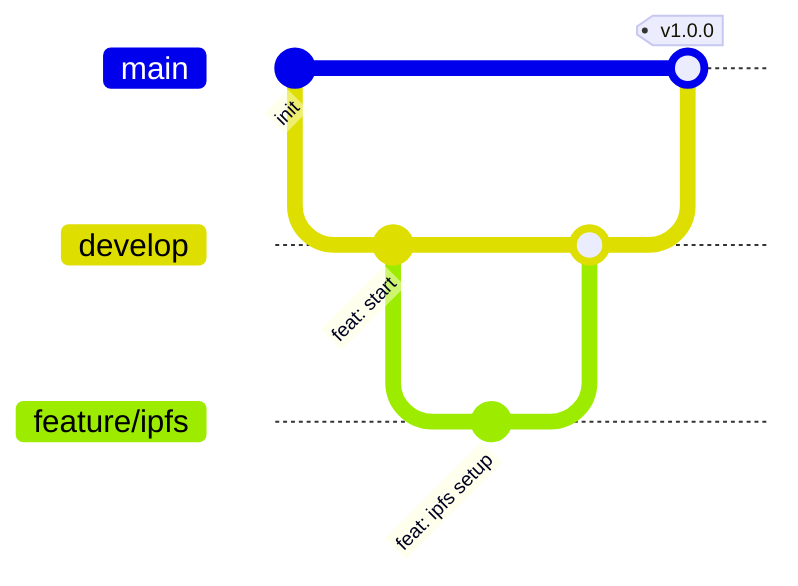

# Git Branching Strategy for digitaloriginal.store (New Website)

**Project:** NFT Marketplace - Next.js 14 Migration  
**GitHub Repository:** https://github.com/andreasnahrgang/digitaloriginal.store_NEW.git  
**Version:** 2.0 (Enhanced with Safety & Automation)  
**Last Updated:** December 1, 2025

---

## 🎯 EXECUTIVE SUMMARY

This git strategy is optimized for the new digitaloriginal.store website built with Next.js 14. It replaces the current live site and focuses on:

- **Solo Developer Workflow:** Streamlined for one primary developer
- **Migration Safety:** Clean transition from old to new site
- **Vercel Integration:** Automated deployment pipeline
- **Production Stability:** Rigorous testing before going live

---

## 🏗️ BRANCH ARCHITECTURE

### Simplified Structure (For Solo Developer)



| Branch          | Deploys To | Status       | Rules                                          |
| --------------- | ---------- | ------------ | ---------------------------------------------- |
| **main**        | Production | 🔒 Protected | PR required, No direct commits, Linear history |
| **develop**     | Preview    | 🔒 Protected | Direct commits OK, No force push               |
| **feature/\***  | Preview    | Ephemeral    | Create from develop, Delete after merge        |
| **refactor/\*** | Preview    | Ephemeral    | For code improvements (e.g., image opt)        |
| **bugfix/\***   | Preview    | Ephemeral    | Non-critical fixes                             |
| **hotfix/\***   | Production | Emergency    | Create from main, Merge to main & develop      |

---

## 🔄 DAILY WORKFLOW PATTERNS

### Pattern 1: Feature Development (Standard)

_For new features, integrations, or complex changes._

1. **Start:**
   ```bash
   git checkout develop
   git pull origin develop
   git checkout -b feature/my-feature
   ```
2. **Work:**
   ```bash
   git add .
   git commit -m "feat(scope): description"
   git push origin feature/my-feature
   ```
3. **Finish:**
   - Create PR: `feature/my-feature` → `develop`
   - Verify Vercel Preview
   - Merge & Delete branch

### Pattern 2: Refactoring (Current Task)

_For code improvements like image optimization._

1. **Start:**
   ```bash
   git checkout develop
   git pull origin develop
   git checkout -b refactor/image-optimization
   ```
2. **Work:**

   ```bash
   # Run optimization script
   npm run optimize

   # Commit changes
   git add .
   git commit -m "refactor(assets): optimize nft images to max 5MB"
   ```

3. **Finish:**
   - Create PR: `refactor/image-optimization` → `develop`
   - Verify Vercel Preview
   - Merge & Delete branch

### Pattern 3: Release to Production

_When develop is stable and ready for live._

1. **Verify:** Test `develop` preview URL thoroughly.
2. **PR:** Create PR `develop` → `main`.
3. **Merge:** Squash and merge.
4. **Tag:**
   ```bash
   git checkout main
   git pull origin main
   git tag -a v1.1.0 -m "Release v1.1.0: Image Optimization"
   git push origin main --tags
   ```

---

## 📝 COMMIT MESSAGE STANDARDS

**Format:** `<type>(<scope>): <subject>`

| Type       | Description                     | Example                                  |
| ---------- | ------------------------------- | ---------------------------------------- |
| `feat`     | New feature                     | `feat(wallet): add thirdweb integration` |
| `fix`      | Bug fix                         | `fix(nft): resolve image loading error`  |
| `refactor` | Code change, no behavior change | `refactor(images): optimize assets`      |
| `chore`    | Build, deps, tooling            | `chore(deps): upgrade next.js`           |
| `docs`     | Documentation                   | `docs(readme): update setup guide`       |

---

## 🚨 EMERGENCY PROCEDURES

### Scenario 1: Production Site Down

**Response Time:** < 5 minutes

**Option A: Vercel Instant Rollback (Fastest)**

1. Go to Vercel Dashboard → Deployments
2. Find last working deployment
3. Click "Promote to Production"

**Option B: Git Revert**

```bash
git checkout main
git pull origin main
git revert <bad-commit-sha> --no-edit
git push origin main
```

### Scenario 2: Accidental Commit to Main

```bash
git checkout main
git reset --hard origin/main
```

---

## ✅ PRE-LAUNCH CHECKLIST

- [ ] **Linting:** `npm run lint` passes
- [ ] **Build:** `npm run build` succeeds
- [ ] **Tests:** Health endpoint returns 200 OK
- [ ] **Preview:** Vercel preview URL verified
- [ ] **Assets:** All images optimized (<5MB)
- [ ] **Env:** Environment variables configured

---

## 🛠️ AUTOMATION SETUP

**Husky & Lint-staged:**

- Runs `eslint --fix` and `prettier --write` on commit
- Prevents bad code from entering repository

**Version Scripts:**

- `npm run version:patch` (v1.0.0 → v1.0.1)
- `npm run version:minor` (v1.0.0 → v1.1.0)
- `npm run version:major` (v1.0.0 → v2.0.0)
